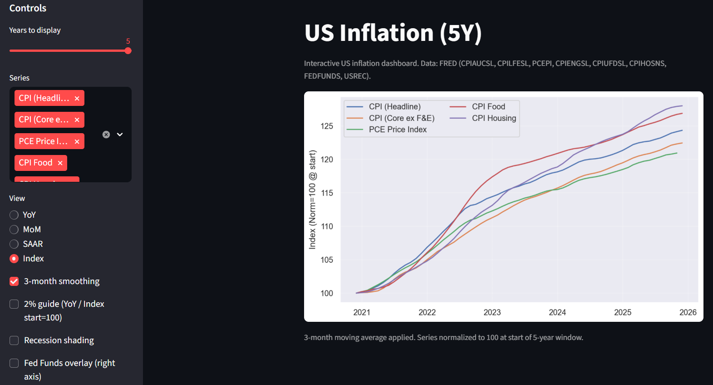

<div align="center">

<h1>US Inflation Dashboard (Streamlit)</h1>
<em>Interactive exploration of US inflation dynamics (CPI, Core CPI, PCE) with recession shading and Fed policy context.</em>

</div>

## Overview

This Streamlit app lets you explore US inflation across multiple measures and time horizons. You can quickly switch among CPI (headline), Core CPI (ex food & energy), and PCE price index, view growth rates (YoY, MoM, SAAR) or level indices, apply smoothing, and overlay macro context (Fed Funds Rate, NBER recession periods, 2% guide line).

All data are pulled on demand from the Federal Reserve Economic Data (FRED) API and cached locally for 24 hours to minimize API calls.

## Why it’s interesting

This dashboard makes it easy to answer practical macro questions:
- Are inflation trends accelerating or cooling right now (MoM vs SAAR)?
- How different are CPI and PCE in the most recent months?
- Is inflation above/below the 2% guide line—and for how long?
- How does inflation typically move around recessions and policy tightening?

## Features

* Choose any combination of inflation series (CPIAUCSL, CPILFESL, PCEPI)
* Time window modes: Last N years slider or custom date range selection
* Multiple view transformations: YoY %, MoM %, annualized SAAR %, or Index (rebased to 100 at window start)
* Plot types: Lines, Bars, or hybrid Lines + Bars
* Optional smoothing (1–12 month moving average)
* Recession shading using NBER recession indicator (USREC)
* Fed Funds Rate overlay with dual y‑axis
* 2% guide line (or 100 for index normalization) toggle
* Lightweight, fast UI powered by Streamlit & Plotly

## Data Sources (FRED Series)

| Purpose | Series ID | Description |
|---------|-----------|-------------|
| Headline CPI | `CPIAUCSL` | Consumer Price Index for All Urban Consumers |
| Core CPI | `CPILFESL` | CPI less Food & Energy |
| PCE Price Index | `PCEPI` | Personal Consumption Expenditures Price Index |
| Policy Rate | `FEDFUNDS` | Effective Federal Funds Rate |
| Recession Indicator | `USREC` | NBER recession periods (0/1) |

## Requirements

* Python 3.9+ (tested with 3.11)
* FRED API key (free from https://fred.stlouisfed.org/)
* Packages listed in `requirements.txt`

## Quick Start

```bash
# Clone
git clone https://github.com/gracegunne/US_Inflation_Dashboard.git
cd US_Inflation_Dashboard

# (Optional) create virtual environment (Windows PowerShell)
python -m venv .venv
\.venv\Scripts\Activate.ps1

# Install dependencies
pip install -r requirements.txt

# Create .env with your FRED key
echo "FRED_API_KEY=YOUR_KEY_HERE" > .env

# Run the app
streamlit run inflation_panel_st.py
```

Then open the local URL Streamlit prints (usually http://localhost:8501).

### Screenshot

After launching locally, capture a screenshot and save it as `dashboard_screenshot.png` in the repo root, then add this line to display it:

```markdown

```

## Configuration

Create a `.env` file in the repository root containing:

```
FRED_API_KEY=YOUR_FRED_KEY
```

If the key is missing or invalid, the app now shows a sidebar prompt where you can paste a valid key without restarting. (For persistent use still add it to `.env`.)

### Caching
Downloaded observations are saved in `data/cache_fred.csv` and reused for up to 24 hours. Delete the file (or change system time range significantly) to force a refresh.

## Usage Guide

1. Select the inflation series you want in the sidebar.
2. Pick a time range mode: Last N years slider or Custom date range.
3. Choose the view (YoY, MoM, SAAR, Index). Index will rebase chosen series to 100 at the start of the window.
4. Optionally enable smoothing (rolling mean) to reduce noise.
5. Change plot style (lines, bars, combo) depending on preference.
6. Toggle recession shading, Fed Funds overlay, and guideline.
7. Hover over the chart for synchronized values; legend items are clickable to hide/show series.

## Computation Details

* YoY: 12‑month percent change.
* MoM: 1‑month percent change.
* SAAR: Annualized rate: $((1 + \text{MoM}/100)^{12} - 1) \times 100$.
* Index normalization: Each selected series rebased to 100 at first valid value inside the selected window.
* Smoothing: Centered rolling mean not used; simple trailing rolling mean with `min_periods=1`.

## Troubleshooting

| Issue | Cause | Fix |
|-------|-------|-----|
| Sidebar asks for API key | `.env` missing or invalid key | Paste key in sidebar or add to `.env` and reload |
| "Missing FRED_API_KEY" error (older versions) | Legacy behavior | Update to latest code; or supply key in `.env` |
| Empty chart | No series selected | Pick at least one CPI/PCE series |
| Very spiky SAAR | No smoothing | Increase smoothing window (3–6) |
| Old data not updating | Cache still valid | Delete `data/cache_fred.csv` |
| API error / timeout | Network or FRED rate limit | Retry after a minute; ensure key is correct |

## Project Structure

```
inflation_panel_st.py   # Streamlit app
data/cache_fred.csv     # Cached FRED responses (auto‑generated)
requirements.txt        # Python dependencies
README.md               # Documentation
```

## Possible Enhancements

* Add CPI component breakdown (e.g., shelter, energy)
* Export chart as PNG/CSV directly from UI
* Compare against Fed inflation projections
* Add automatic refresh button & cache age display

## License

This project is licensed under the **MIT License** (see `LICENSE`).

## Recession Shading Logic

Recession periods use the monthly `USREC` (0/1) series. Consecutive months with value > 0.5 are grouped into blocks and rendered as light gray vertical rectangles behind the main traces. The algorithm walks the boolean series, recording start when entering a recession and end when leaving; an unfinished block at the end extends to the latest date.

## Acknowledgments

Data courtesy of Federal Reserve Bank of St. Louis (FRED). Built with Streamlit, Plotly, Pandas, NumPy.

---
Feel free to open issues or submit pull requests with improvements.

<!-- Screenshot placeholder -->
<!--  -->


